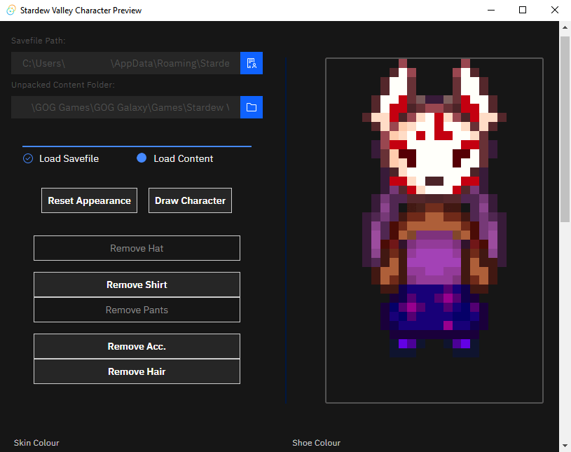

## Stardew Valley Character Preview (SVCP)

Think of it as a sort of standalone Kisekae application for Stardew Valley characters. SVCP loads your character's attributes from your savefile, and you can play around with different outfits, colours, and accessories.

*Requires access to your game's unpacked "Content" folder for fetching sprites.*

Tested with Stardew Valley version 1.5 and Windows 10 (with Microsoft [Edge WebView2](https://developer.microsoft.com/en-us/microsoft-edge/webview2/#download-section)).

It will probably work on any Windows 10 computer with Edge installed, or a modern-enough version of macOS or Linux.

### Features:
  - Preview your Stardew Valley character by uploading a savefile
  - Import sprites for custom content (hair, accessory, hats, shirt, pants) from .PNG files (compatible with [JSON Assets](https://github.com/spacechase0/JsonAssets) files)
  - Change colours of items (shoes, hair, skin, shirt, pants)
  - Choose from the vanilla hats, shirts, pants, accessories, hairstyles
  - Lets you choose your character base sprite
  - Lets you select a direction for your character to face
  - Save your character preview as a .PNG (right-click, "Save Image As")

#### Stuff it Doesn't Do:
  - Write to or modify your savefile in any way
  - Let you change your character pose (other than the direction they're facing) or animate them
  
#### Credits:

[Stardew Valley](https://www.stardewvalley.net/) is the property of ConcernedApe LLC.
Preview screenshot uses custom content from [contrarequiallas' Kitsune Masks](https://www.nexusmods.com/stardewvalley/mods/2570) and from [Lumisteria Clothes](https://www.nexusmods.com/stardewvalley/mods/5760). 

Font used in the logo is from [https://www.reddit.com/r/StardewValley/comments/4dtgp7/by_popular_request_a_stardew_valley_font_for_your/](https://www.reddit.com/r/StardewValley/comments/4dtgp7/by_popular_request_a_stardew_valley_font_for_your/)

Project inspired by the awesome community of Stardew Valley players and modders.

#### Basic Instructions:

After downloading the latest build for your system from the Releases page, install it as you would normally install a desktop application. Then, open the newly-installed SVCP.

Click on the blue button to the right of the "Savefile Path" box, and navigate to your Stardew Valley
save file (usually in your `~/AppData/Roaming/StardewValley/Saves` folder, in a folder with your farm name followed by some numbers). The file you're looking for has the same name as its parent folder.

Click on your save file, then click "Open" on the dialog window to load it.

Next, if that worked, click the blue button to the right of the box below to load your Unpacked Content folder. You'll need to use something like [Stardew XnbHack](https://github.com/Pathoschild/StardewXnbHack) to unpack your game's Content folder (so the raw .PNG images are available). Navigate to that folder, (an example would be: `C:\GOG Games\GOG Galaxy\Games\Stardew Valley\Content (unpacked)` but yours may be different) and click "Select Folder" once you're inside it.

Next, you can click the "Draw Character" button to draw your character in the canvas to the right. If all goes well, you should see your character appear in a second or so.

**Note that every change you make to your character preview needs to be followed by pressing the "Draw Character" button before your character preview will update**

#### Customizing your Character Preview

**Note that this does not alter your save file in any way**

*Also note that any custom content your character is wearing will be reset to default vanilla sprites; you can add custom stuff back in later.*

You can click on the "Reset Appearance" button at any time to reset your character preview to match your character's original appearance from your savefile.

You can remove your character's hat, accessory, hair, or shirt/pants (for the latter two, it will go to the default
shirt/pants) by clicking the corresponding button under the "Reset Appearance" and "Draw Character" buttons.

##### Sliders:

You can change your character's skin colour, shoe colour, hair, accessory, hat, shirt, or pants using the sliders.

Note that "-1" means "no hat/accessory" and "0" means the first in the list.

**Also note that hair will not change based on your hat, so you might want to switch to a "hat-friendly" hairstyle if your character has a hat. See [https://stardewvalleywiki.com/Modding:Farmer_sprite](https://stardewvalleywiki.com/Modding:Farmer_sprite) for more info.**

##### Custom Content:

Click on the hanger icon to the left of the "Custom x:" fields at the bottom of the window (you may have to scroll down
to see them). You can use these to give your character a custom hairstyle, accessory, hat, shirt, or pair of pants.

The dimensions for the spritesheets are listed below. Note that even though the sprite corresponding to the front-facing
pose will be used, the entire spritesheet must be given to SVCP (for future-proofing, mostly).

Note that if you load in a spritesheet with multiple hats/shirts/etc., only the one in the top-left will be loaded in.

You can use a program like [Paint.NET](https://www.getpaint.net/) to edit a spritesheet to get the single sprite you want.

##### Base Sprite:

*At least 16 x 96 for four base poses* (note that arms will be the default base sprite if your custom base sprite is 96 or under in width)

###### Hair:

*16 x 32 pixels*

###### Accessories:

*16 x 16 pixels*

###### Hat:

*20 x 20 pixels*

###### Shirt:

*8 x 32 pixels*

###### Pants:

*16 x 32 pixels*

##### Changing Colours:

Click on any of the palette icons on the colour fields at the bottom of the window to change the colour of your character's shirt, pants, hair, or eyes.

When the dialog pops up, use the provided colour picker to select a colour, then click outside the dialog or click the "x" button at its top-right (not the "X" to close the SVCP window, though) to close the dialog and ratify your colour selection.

**After changing any attributes of your character preview, you will need to press the "Draw Character" button again to regenerate the preview**

*You can remove the shirt and/or pants colour to revert your character to the default colour of whatever shirt/pants they're wearing*

#### Known Issues:
  - Certain shirt indices aren't actually used in-game, so if selected the sprite will be broken/non-existent.
  - The pants directional sprites are... probably correct. It's hard to tell because the pants spritesheets are big and rather complicated.
  - Sometimes the tinting function messes with transparencies. Sometimes; hard to tell how/why.

#### Troubleshooting:
  - If in doubt, or if the loading circle won't go away, close and re-open the window, or press F5 to refresh the window (if available).
  - Check that your savefile and content paths are correct as shown.
  - Check that any custom content you loaded in matches the correct dimensions.

#### Giving Feedback:

If you've found SVCP useful in any way, or you wanted to give some feedback, the best place for that is probably the SVCP page on Nexus Mods.

#### Reporting Bugs:

SVCP is essentially feature-complete at this stage, but that doesn't mean it's perfect. If you happen to encounter any issues (or have suggestions for the future of this project), don't hesitate to open an Issue on this repository.

#### Technical Info:

SVCP is made using [Tauri](https://tauri.studio), with a Svelte front-end and a Rust back-end. IBM's Carbon UI framework is used on the front-end, and image-rs and imageproc are used on the Rust backend. For more specific info, feel free to peruse the codebase 😃.

#### Contributing:

SVCP welcomes contributions of any kind. If you have some experience with JavaScript and/or Rust (or you just noticed a typo somewhere 👓) go ahead and open up a Pull Request on this repository.

#### Developing:

This project uses `yarn`, but you could make it work with `npm` as well.

`yarn` fetches the Node dependencies; it should be run first-thing after cloning this repo or downloading the source as a .ZIP.

`yarn tauri dev` starts a dev server, and `yarn tauri build` compiles a production binary. Tauri takes care of communicating with Rust and Node, and should be nearly turn-key to use.

The `src` folder holds the JavaScript/Svelte source files, and the `src-tauri` directory holds the Rust files, Tauri configuration, etc.

`src-tauri/target/release/bundle` is where build production binaries are stored after compilation.

Tauri's Rust bundler should be installed, along with its pre-reqs for your setup. See [tauri.studio](https://tauri.studio) for more info.

#### About OverScore Media

OverScore Media is a distributed software, web, and digital design agency that operates in Peterborough, Ontario. We're always looking for passionate creators to join our team, and we offer free, comprehensive consultations for all projects. Visit our website at [overscore.media](https://overscore.media) for more information about our services.

---

#### TODO:

**Integrate Self-Updater:**
  - https://tauri.studio/en/docs/usage/guides/updater

**Allow the maximize button to un-maximize**

**Better/more-reliable GitHub Actions build automation**

**Replace the UI with Tailwind.CSS**

**Better image saving mechanism**