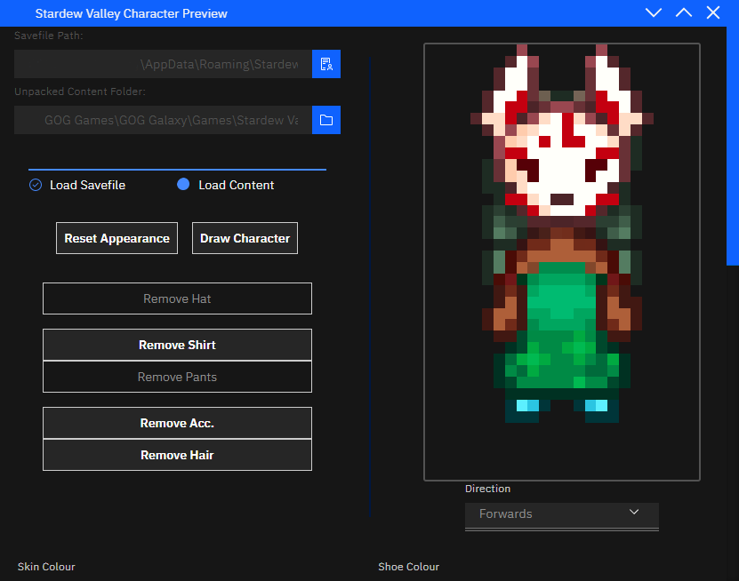

## Stardew Valley Character Preview (SVCP)

#### QoL To Do:
  - Test hairstyles2 and other hairstyles indices
  - **Fix Shirt Index for higher shirts**
  - **Fix Shoe Index**
  - **Fix Hair Index**
  - **Fix the Styling**
  - **Check all indices**
  - **Add colouring**
  - Error Checking
  - Setup ESLint
  - Setup Rustfmt
  - Migrate to GitHub
  - Setup GitHub Actions to build for desktop (Windows/Mac/Linux)
  - Cleanup code; add more comments
  - Clean up repo; customize metadata
  - License and contribution/bug report instructions
  - Fix the bug where the first dialog doesn't open
  - Get hairstyles to change based on hat attributes

#### Maybe To Do:
  - Move more work to the Rust backend
  - Get animations to work; sounds expensive
  - Colour picker for tints?
  - Change outfits based on index or something (like arrows to swap out hats/shirts/etc.)
  - Different poses
  - Player information window?